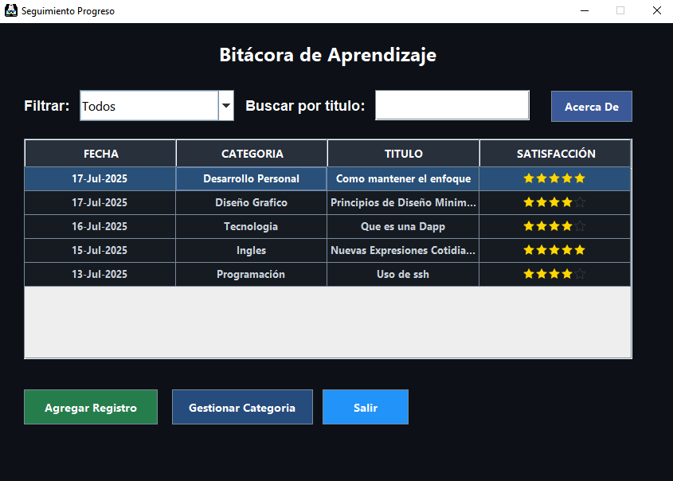
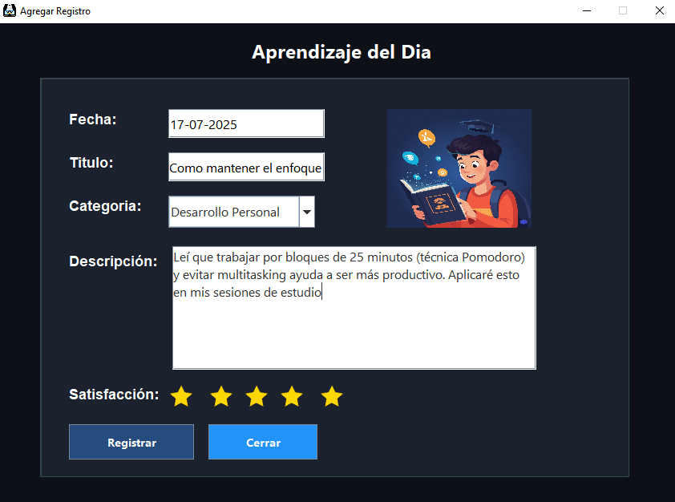
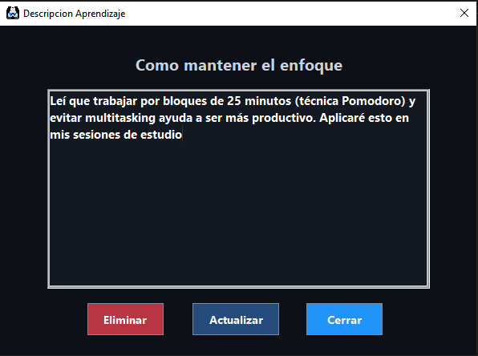

# 📝 Sistema Bitácoras en Java

Este proyecto consiste en un sistema de bitácoras desarrollado en Java, diseñado para registrar y consultar el aprendizaje diario. Su propósito es servir como una herramienta de apoyo para la reflexión del progreso, organización del conocimiento y fortalecimiento del proceso de aprendizaje a largo plazo.

## 🚀 Características

- Interfaz gráfica intuitiva (Java Swing)
- Facilidad para crear nuevas categorias y registros
- Almacenamiento de la información en una BD local 
- Busquedas rapidas de los registros por categoria y por titulo
- Incluye ejecutable `.exe` y JRE para facilitar la ejecución sin necesidad de tener Java instalado

## 📷 Capturas de pantalla




## 🛠️ Tecnologías utilizadas

- Java 21
- Swing para interfaz gráfica
- SQLite como base de datos
- JRE embebido (Java Runtime Environment)

## 📦 Descargar Versión Ejecutable

> Si no quieres compilar el código y solo deseas usar el sistema:

🔽 **[Descargar sistema-bitacora.zip desde Releases](https://github.com/RGBCode0/sistema-bitacora/releases/latest)**

El ZIP incluye:
- `sistema-bitacora.exe`
- Base de datos lista para usar
- JRE incluido

Solo descomprime y ejecuta. No requiere instalación.

---

## 💻 Clonar el Proyecto

Si deseas ver o modificar el código fuente:

```bash
git clone https://github.com/RGBCode0/Sistema-Bitacora-java.git
```

> Luego puedes abrir el proyecto con tu IDE favorito (NetBeans, VS Code, IntelliJ, etc.)

---

## 📌 Requisitos para Desarrollo

- Java Development Kit (JDK) 21
- IDE con soporte para proyectos Java
- Conocimientos básicos de Java Swing
- SQLite 

---

## 📄 Licencia

Este proyecto fue creado con fines educativos y puede ser usado, modificado o compartido libremente.

Licencia: [MIT](LICENSE)

---

## 🙋‍♂️ Autor

Desarrollado por **Rael Gabriel Bautista**  
🔗 [Portafolio Web](https://mistiorgbcode.com)

---
Gracias por visitar este proyecto. ¡Cualquier sugerencia, pull request o mejora es bienvenida! 


